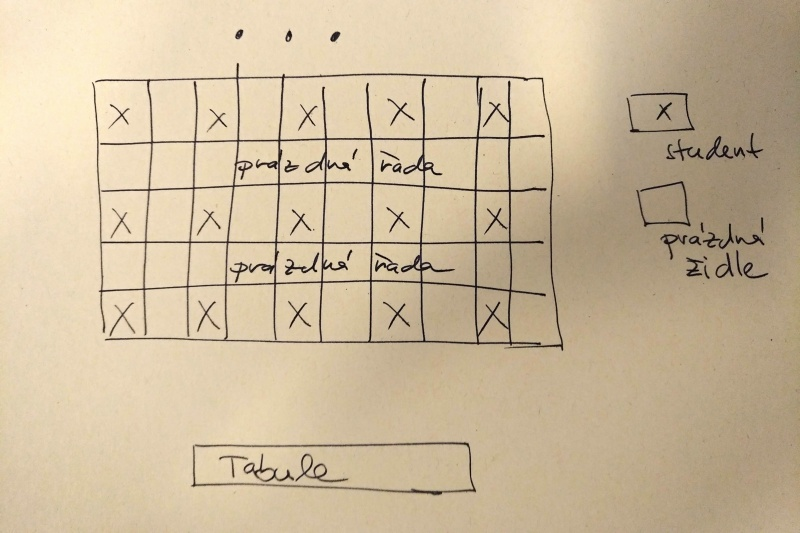

## Přihlašování, hodnocení a opravy

Na termín testu je nutné se přihlásit pomocí systému InSIS. Pokud se
bez omluvy nedostavíte ani na jeden z termínů testu, je vám předmět
automaticky klasifikován jako "nedostavil(a) se".

Pokud z testu získáte méně než 24 bodů, je možné psát opravu. Na
opravný test se již pomocí InSISu nepřihlašuje. Z opravného testu lze
získat maximálně 24 bodů.

Test hodnotí přednášející.

## Zasedací pořádek

Před testem se studenti sami rozsadí podle následujícího schématu.

Řady se postupně zaplňují směrem od tabule.

## Psaní testu v případě evakuace VŠE

Pokud by v době psaní testu byla budova VŠE evakuována, píše se test
v náhradní lokalitě, viz: [https://mapy.cz/s/mugarejotu](https://mapy.cz/s/mugarejotu) Čas začátku
testu je v tomto případě o 15 minut posunut.

Tipy pro případ, že by tato situace nastala:

* nenechávejte si v den psaní testu oblečení v šatně, aby vám
  v případě rychlé evakuace nebyla venku zima

* vemte si do školy pevnou podložku, na které se vám bude test dobře
  psát, i když k dispozici nebudete mít stůl

* test se píše za jakéholiv počasí, takže sledujte předpověď počasí a
  dle potřeby se vybavte teplým a nepromokavým oblečením

* pro vaše pohodlí doporučuji nepromokavou podložku nebo rybářskou
  stoličku, na které budete během testu sedět

* test lze psát i ve stoje

* zkontrolujte si čas východu a západu slunce a případně se vybavte
  čelovou svítilnou

**Vše výše uvedené je míněno zcela vážně!!!**
